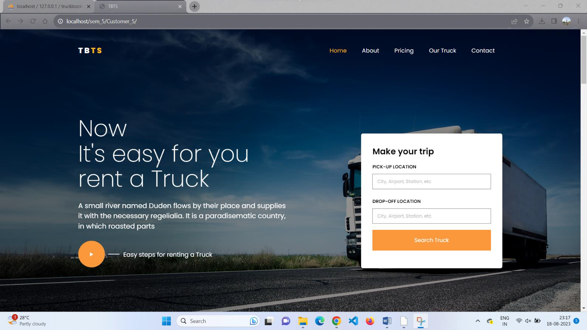
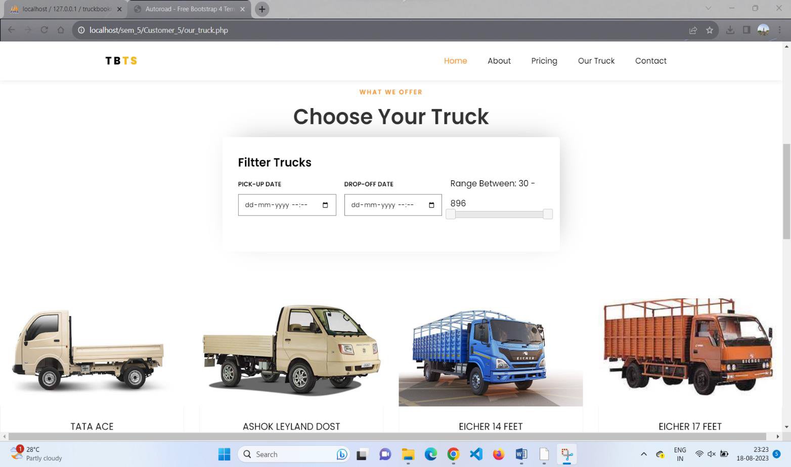
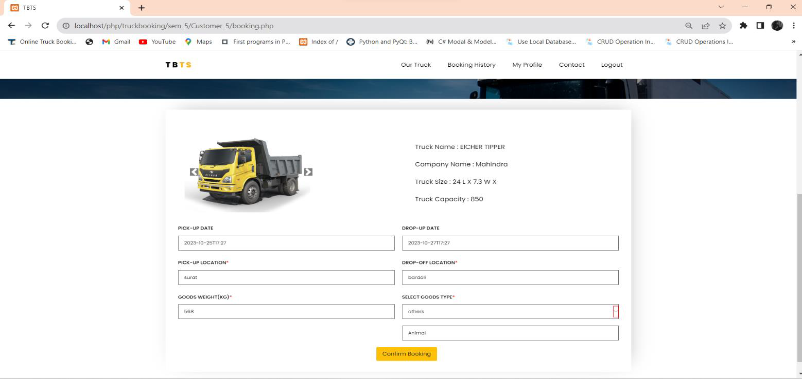
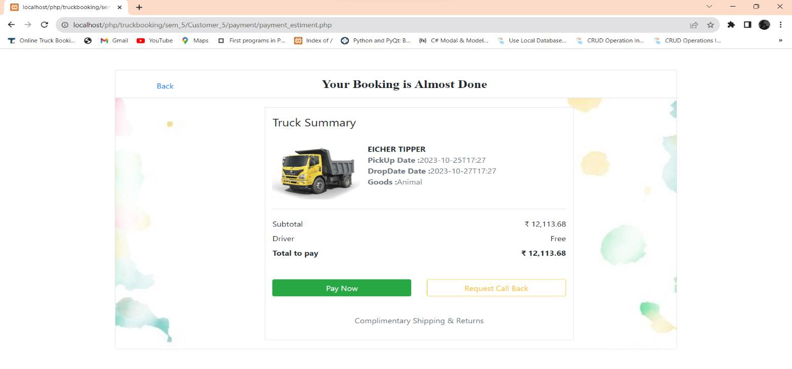
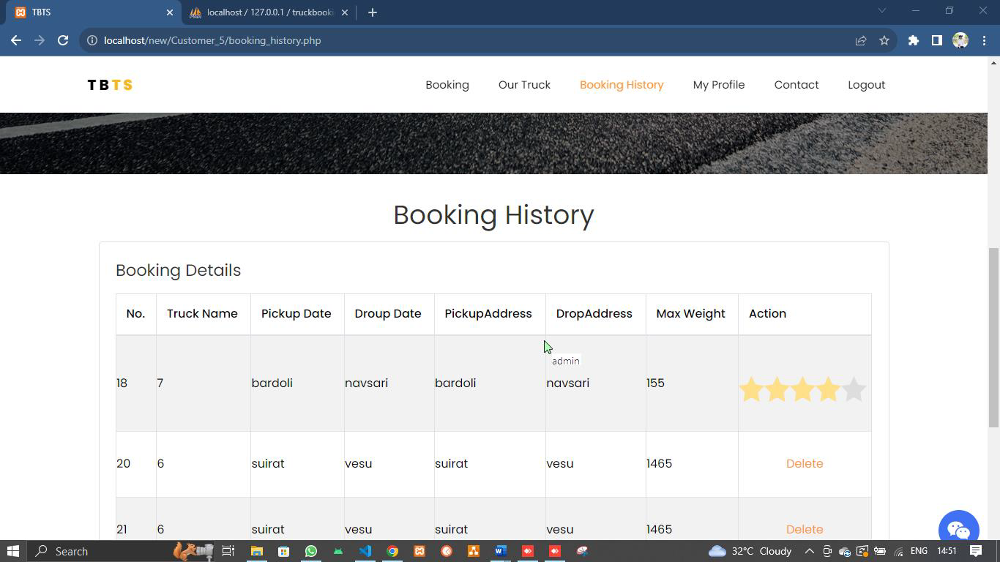
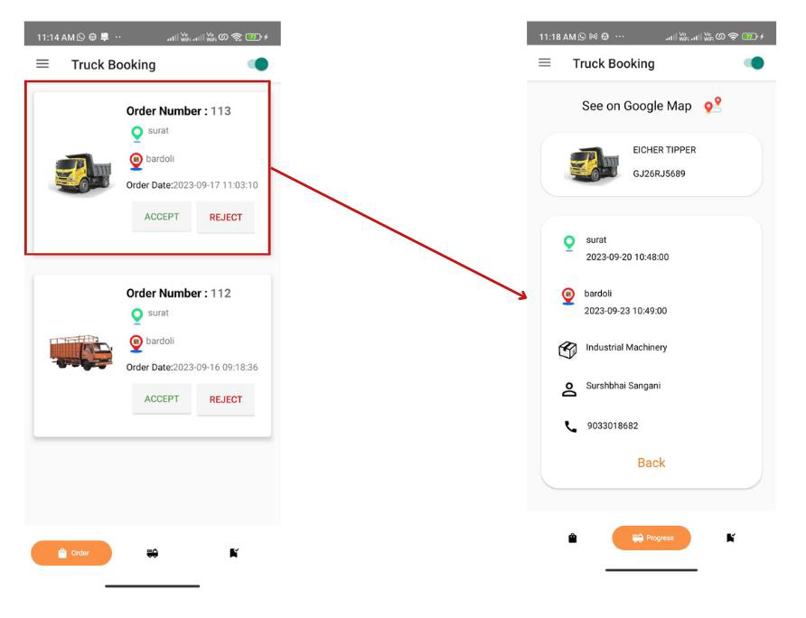

# 🚚 Truck Booking System  

## 📖 Project Overview  

The *Truck Booking System* is a digital platform designed to simplify the process of booking trucks for transportation services. It connects *customers, **transporters, **drivers, and **admins* in a single ecosystem.  

- *Customers* can register, view truck details, book trucks, make payments, and track booking history.  

- *Transporters* can manage trucks, assign orders to drivers, track drivers’ locations, and view payment reports.  

- *Drivers* use a mobile app to receive orders, update status, and complete bookings.  

- *Admins* manage users, payments, reports, and feedback.  

The system includes *web and mobile applications*, integrated payment handling, and real-time driver tracking.  

---

## 🎯 Features  

### 🔑 Core Functionalities  

- User Registration & Login with OTP  

- Profile Management & Password Reset  

- Truck Management (Add, Update, Deactivate)  

- Truck Booking with Fare Estimation  

- Booking History & Cancellations  

- Notifications via SMS/Email  

- Payment Management (Split between Admin & Transporter)  

- Feedback & Rating System  

- Driver Order Management (Accept/Reject Orders)  

- Real-time Driver Location & Status Updates  

### ⚙ Non-Functional Requirements  

- *Security*: Two-step authentication via OTP  

- *Usability*: Intuitive navigation, user-friendly forms, proper validation & error messages  

---

## 👥 User Roles  

1. *Admin*  

   - Manage customers & transporters  

   - View payments, reports, and feedback  

2. *Customer*  

   - Book trucks, make payments, view booking history  

   - Provide feedback & ratings  

3. *Transporter*  

   - Add/manage trucks & drivers  

   - Assign orders to drivers  

   - Track drivers & view reports  

4. *Driver (Mobile App)*  

   - Accept/reject orders  

   - Update status (Online/Offline)  

   - Mark orders as complete  

   - Share current location  

---

## 🛠 Tools & Technologies  

### Frontend  

- *HTML5, CSS3, Bootstrap 5*  

- *JavaScript (ES2022), Ajax*  

- *Dart (for Flutter Mobile App)*  

### Backend  

- *PHP 7.0*  

- *Java*  

- *MySQL* (Database)  

### Other Tools  

- *XAMPP* (Web Server)  

- *VS Code, Android Studio* (Editors)  

- *Draw.io, UMLet* (Diagrams)  

- *Selenium IDE, Katalon Studio, Postman, JMeter* (Testing Tools)  

---

## 🗂 Database Overview  

The system uses *15 main tables*, including:  

- user_master – Stores customer & transporter details  

- truck_details – Stores truck information (model, capacity, fuel type, charges)  

- truck_booking – Stores booking details  

- truck_driver – Stores driver details  

- driver_location – Stores driver real-time location  

- payment, admin_payment, transporter_payment – Payment tracking  

- feedback & truck_rating – Customer feedback  

---

## 📱 User Interfaces  

Some of the implemented screens:  

- *Home Page*  

    

- *View Trucks*  

    

- *Truck Booking*  

    

- *Payment Page*  

    

- *Booking History*  

    

- *Driver Mobile App – Assign Orders*  

    

> *(Replace screenshots/... with actual paths to images from your project or extracted from the PDF.)*  

---

## 📊 Reports & Dashboards  

- *Admin Dashboard*: City-wise & year-wise booking reports, customer/feedback management.  

- *Transporter Dashboard*: Truck & booking overview, payment reports, driver status.  

---

## ✅ Testing  

The project was tested using:  

- *Manual Testing* (forms, validations, workflows)  

- *Automation Testing*: Selenium IDE, Katalon Studio  

- *API Testing*: Postman  

- *Load Testing*: JMeter  

---

## 🚀 How to Run the Project  

1. Install *XAMPP* (for Apache + MySQL).  

2. Clone/Extract the project files into the htdocs folder.  

3. Import the database from truck_booking.sql into *phpMyAdmin*.  

4. Configure database connection in config.php.  

5. Run the project at:  

   

   http://localhost/truckbooking

     

6. For *Driver Mobile App, open the Flutter project in **Android Studio*, configure backend API URLs, and run on an emulator/device.  

---

## 📌 Future Enhancements  

- Integration with *Google Maps API* for real-time route tracking.  

- Online Wallet/UPI Payment integration.  

- Multi-truck booking by customers.  

- AI-based truck allocation for optimized logistics.